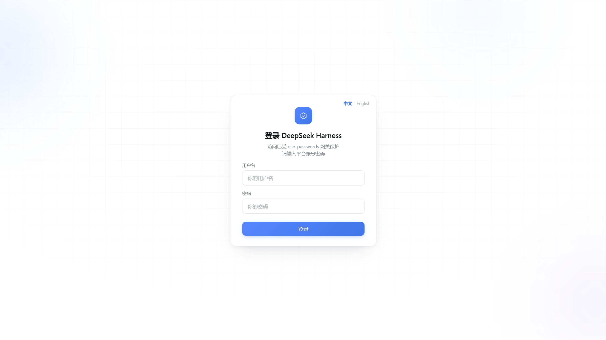
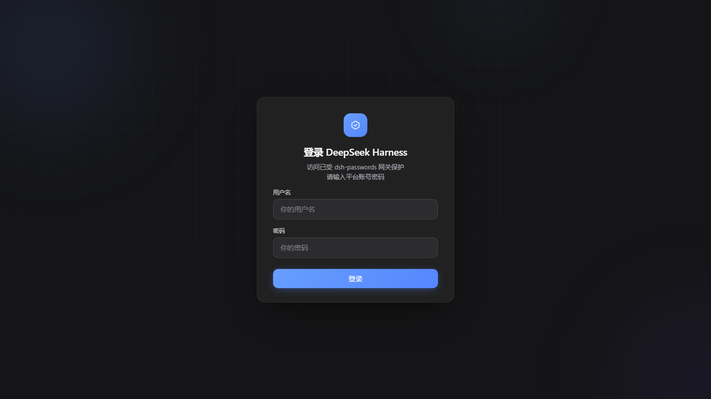
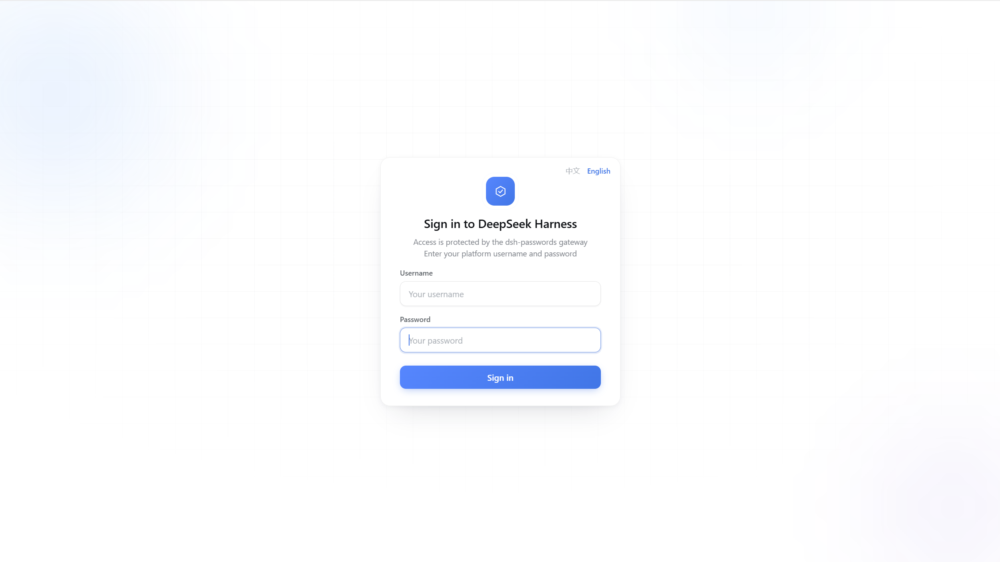
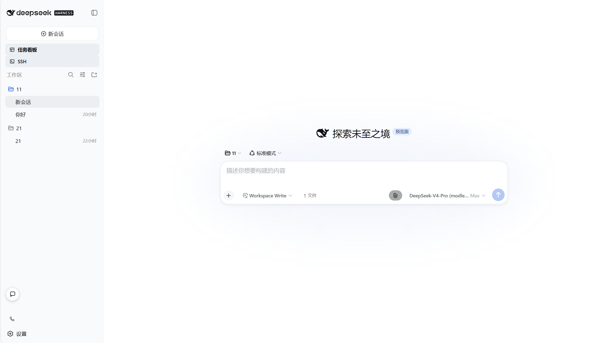
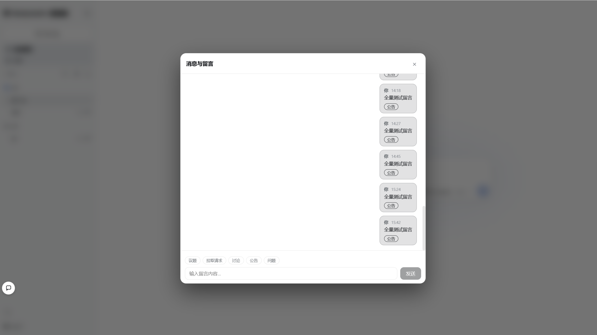
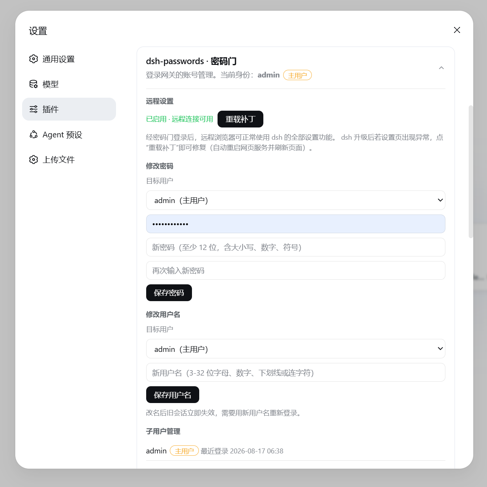
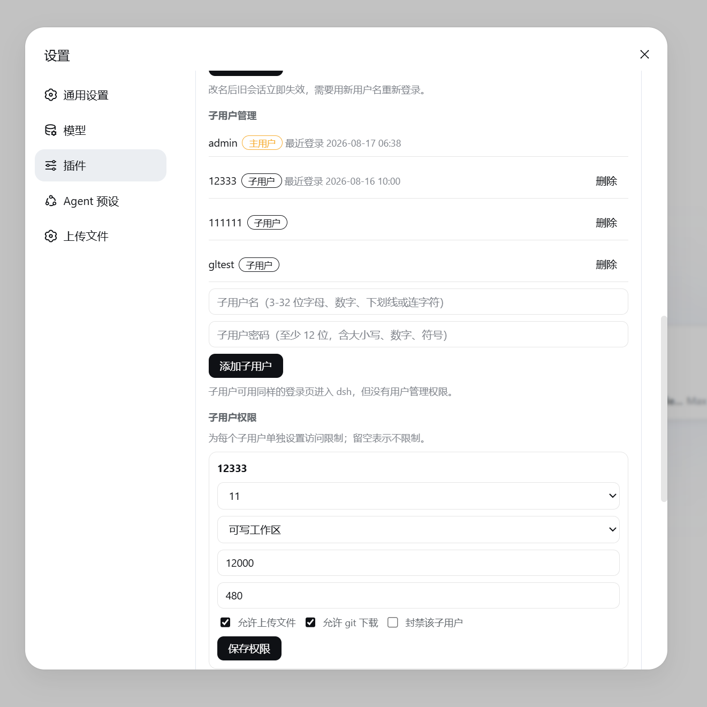

# dsh-passwords

[English](README_en.md) | 简体中文

为 DeepSeek Harness（dsh）的网页入口加上登录、账号管理和访问控制，适合把 dsh 放到服务器上给团队或客户使用。

dsh 的网页界面默认面向本机使用。服务器地址一旦暴露，拿到链接的人就可以进入，也会共用模型额度。dsh-passwords 放在 dsh 前面：先登录，再按账号应用工作区、会话、沙盒和用量限制。

纯本机使用 dsh 不需要安装它；需要远程访问、多人共用或管理子账号时再使用即可。

收录于 [Awesome DeepSeek Harness](https://github.com/0xsline/awesome-deepseek-harness)（Infrastructure & Development）和 [Awesome DSH Plugin](https://github.com/awesome-dsh-plugin/awesome-dsh-plugin)（Development & Runtime）。

## 功能一览

### 1️⃣ 远程连接

- 登录页 + 首次配置页（第一次访问先设主账号，之后谁访问都先过登录页）
- 登录一次管 12 小时（Cookie 会话，关浏览器也不丢）
- **自动 HTTPS**：首次启动 dsh 时申请 Let's Encrypt 证书，之后自动续期；80 端口会跳转到 443
- 登录页自动跟着 dsh 的主题走（dsh 用深色它就深色）
- 可从远程浏览器使用 dsh 设置；若 dsh 升级后设置页异常，可在插件卡片中点“重载补丁”修复

### 2️⃣ 多用户

- 一个**主用户**（首次配置创建）+ 任意多个**子用户**，各自独立账号密码登录
- 所有账号管理都在 dsh 设置页的卡片里完成，不用 SSH：改密码、改用户名、创建/删除子用户
- 新增子用户时自动在宿主机创建并注册一个专属工作区（默认 `~/dsh-user-workspaces/u<用户ID>`），初始沙盒为“可写工作区”；旧子用户会在升级后首次启动时自动补建
- 子用户可从左侧栏 Workspace 上方的“文件夹管理”打开独立管理页，浏览自己的托管目录、下载或删除文件、递归删除文件夹，并把本机文件或整个文件夹上传到当前目录；文件夹层级会保留（浏览器不提供空目录，因此不会单独创建空目录），路径不会暴露或越出其他账号及宿主机目录
- 当前身份旁提供“退出登录”按钮；确认后服务端立即吊销会话并清除 Cookie
- 主用户可管理所有子用户；子用户只能改自己
- 改密后旧会话全部立即失效；每次登录/失败都有记录，一条命令就能查谁在什么时候登录过

### 3️⃣ 权限与配额

主用户可以在设置页给每个子用户单独配置：

- **工作区与会话权限**：主用户在每个子用户权限面板中用滑动开关开启工作区；开启后其中的活动会话默认全部可用，也可逐条取消勾选。归档会话不会出现在设置里
- **会话与消息隔离**：子用户只能看到已授权工作区和启用会话；留言只显示广播、发给自己或自己发出的内容
- **消息默认私信**：子用户留言默认只发给主用户；广播仅主用户可发且需显式勾选
- **每小时 token 上限**、**每日使用时长上限**：到量自动拒绝
- **每月模型金额额度**：以人民币微元整数保存，精确到 ¥0.01；显示本月已用、剩余和 80% 预警，达到 100% 后拒绝下一模型步骤
- **客户模型范围**：子用户在 ChatGPT（Codex）服务商下只显示 GPT-5.6-Sol、GPT-5.6-Terra、GPT-5.6-Luna，其他服务商模型保持可用；服务端同时拒绝子用户调用其他 Codex 模型，主用户不受限制
- **沙盒权限**：只读 / 可写工作区 / 完全访问，三档可选；子用户的 AI 想越权提权时，网关直接把审批改成「拒绝」
- **上传开关**（同时控制专属文件夹上传）、**git 下载开关**、**封禁子用户**

### 4️⃣ 协作

- 界面左下角的聊天按钮可用鼠标或触摸直接拖动，位置保存在当前浏览器；主用户和子用户之间可留言、打标签（议题 / 拉取请求 / 讨论 / 公告 / 问题），每个账号都可在设置中单独隐藏聊天入口

### 5️⃣ 本机工作区

- 每个登录用户可把自己电脑上的一个或多个目录配对为独立工作区，无需把文件上传到 dsh 服务器
- dsh 的 `read`、`write`、`edit`、`glob`、`grep` 会通过本机助手直接操作授权目录中的原文件
- Windows EXE 自动启用 `--allow-shell`，包括恢复已有工作区；非 Windows EXE 命令行模式默认关闭，显式添加后 Shell 才会在该用户电脑上执行
- Windows 工作区自动注册 `word_native_status`、`word_native_read`、`word_native_edit`：优先调用客户电脑已经安装的 Microsoft Word，不可用时回退 WPS 文字，不依赖 `@univerjs-pro/*`

## 身份与消费额度同步

所有主用户和子用户都只使用本项目数据库中的本地账号与 bcrypt 密码登录；数据库默认使用 SQLite，也可切换到 MySQL 8。网关会删除浏览器自行提交的身份头，再为上游请求生成 30 秒有效的 HMAC 身份断言；Harness 验证后把 principal 固化到每条消息、模型步骤和工具执行。

子账号首次登录和后续刷新使用的工作区、会话列表均在服务端按本人权限过滤；浏览器不会先收到管理员数据再等待客户端隐藏。

切换数据库驱动只会选择目标数据库，不会自动复制另一驱动中的历史行。已有账号的生产环境应先备份 `.env` 和数据库并单独迁移；首次部署到空库可直接切换。

MySQL 模式会在空闲超时、服务重启或短暂网络断开后自动替换失效连接。事务外的只读查询会安全重试一次；事务中断和结果不明确的写入不会自动重放，避免重复修改数据。

每个模型步骤开始前同时检查封禁、小时 token、每日时长和个人月额度，任一失败即拒绝。客户在额度用完后提问时，会话会明确显示已用额度、额度上限、本次问题未发送给模型以及联系管理员增加额度的提示。已开始的模型调用允许完成，因此最终金额可能小幅超过额度。金额由 `dsh-spend` 按 `(sessionId, turn, step)` 幂等归集；自然月固定使用 `Asia/Shanghai`，修改额度不会删除或清零历史账，管理员默认不限金额。插件会把当前账号的额度解析器注册给 `dsh-spend`，子账号可在 Spend 悬浮预览和总览中直接看到自己的人民币剩余额度。

外部文件服务及其账号、密码和数据库由对应的独立插件管理，不属于 dsh-passwords 的登录或配置范围。

## 界面截图

| 登录页 · 浅色 | 登录页 · 深色 | 登录页 · English |
|:---:|:---:|:---:|
|  |  |  |

| dsh 主界面（登录后） | 聊天 / 留言 | 设置页卡片 · 账号管理 |
|:---:|:---:|:---:|
|  |  |  |

| | 设置页卡片 · 权限与配额 | |
|:---:|:---:|:---:|
| |  | |
## 快速开始

### 0. 前置条件（三样）

1. **Node.js 22.5+**：`node -v` 查看（Linux：`curl -fsSL https://deb.nodesource.com/setup_22.x | sudo -E bash - && sudo apt-get install -y nodejs`；Windows：nodejs.org 下载安装包）
2. **dsh 已装好**：`npm install -g @deepseek-ai/dsh`，并已能正常对话（dsh 自身的模型连接配置好即可；本插件不需要任何额外配置）
3. **git**：Linux 没装就 `apt-get install -y git`；Windows 去 git-scm.com 下载（pnpm 缺了脚本会自动装）

### 1. 安装（按平台）

```bash
# Linux / macOS —— 方式 A：直接下载安装
curl -fsSL https://raw.githubusercontent.com/sdwhwzp/dsh-passwords/main/install.sh | bash

# Linux / macOS —— 方式 B：先 clone 再装
git clone https://github.com/sdwhwzp/dsh-passwords
cd dsh-passwords
bash install.sh
```

**Windows**：下载仓库里的 `install.bat` 双击运行（或 clone 后运行）。它会自动把项目装到 `%USERPROFILE%\dsh-passwords` 并完成全部配置。Windows 上绑 80/443 **不需要管理员权限**；端口被占用时网关会以错误码 32 提示。

**npm 用户**：

```bash
npm install -g dsh-passwords
dsh-passwords install     # 生成随机 SETUP_KEY + 恢复插件栈 + 应用补丁（等价一键安装）
```

（`dsh-passwords --version` 看版本；`dsh-passwords serve-gateway` 手动启动网关。）

安装脚本会检查预构建文件，缺失时再安装依赖和编译；随后生成 `SETUP_KEY`、恢复已记录的 web profile 插件栈并应用远程设置补丁。

### 自动恢复已安装插件

`scripts/profile-plugins.json` 是跨机器部署的版本化插件清单。运行 `dsh-passwords install` 会把清单中的 NPM/Git 来源、bundle 顺序、Git 构建授权和必要的 profile patch 幂等合并到 `~/.dsh/profiles/web`，然后统一执行 `pnpm install`。已有本地 `link:` 开发源和未纳入清单的自定义插件不会被覆盖或删除；清单明确标记的旧聚合包会自动迁移。

清单默认自动安装 `dshmarket@1.16.2`、你自己的 `sdwhwzp/dsh-web` 仓库 `dev` 分支中的 `@linxin666/dsh-web-all`、`dsh-spend` 的 `dev` 分支、`dsh-plugin-subscriptions` 的 `dev` 分支以及当前 `dsh-passwords`。安装器会移除已停用的 `@linxin666/dsh-web-ui-all` 依赖和 bundle；如果 `dsh-web` 与 `dsh-passwords` 位于同一父目录，则优先链接并构建本地 `dsh-web` 聚合包及其全部 workspace 子包，确保 DSH 能从 profile 根目录解析每个 loader，也便于直接开发。`dsh-plugin-subscriptions` 始终使用记录的 `github:sdwhwzp/dsh-plugin-subscriptions#dev`，避免新机器误装 NPM 稳定版。

`dsh-shandong-tizhi-brand` 和 `dsh-nas-webdav` 也在清单中，但目前只有本机源码，没有可公开拉取的远程分支。新机器部署前分别设置 `DSH_PLUGIN_BRAND_SPEC` 和 `DSH_PLUGIN_NAS_SPEC` 为可访问的 NPM、Git 或 `link:` 来源；未设置时安装器会明确提示并跳过，其他插件继续安装。

结束时会显示首次配置用的 `SETUP_KEY`，并在安装目录写入 `setup-key.txt`。首次配置完成后，这个文件会自动删除；`.env` 中实际使用的密钥会被保留为独立值。

### 2. 三步完成首次配置

1. 用平时的方式启动 dsh（dsh 的模型密钥已配好即可，直接运行 `dsh web`；密码门本身无需任何额外配置）——**密码门会被自动拉起，不需要任何额外启动命令**
2. 浏览器直接打开 `https://<服务器IP>.sslip.io`——第一次访问会**自动进入「首次配置」页**，输入 SETUP_KEY，创建主用户（不用手动输入 `/gateway/setup`）
3. 之后所有人访问 `https://<服务器IP>.sslip.io` 都会先过登录页

别忘了在防火墙**和云服务商安全组**里放行 **80 和 443** 端口（开不了 80 的机器见下面的「部署场景矩阵」）。

## 本机工作区助手

本机助手适合“dsh 在服务器、文件在每个使用者电脑”的场景。助手由用户电脑主动连接服务器，不要求用户电脑开放入站端口；配对后，该目录会作为工作区出现在 dsh 侧栏中。

Windows 使用者不需要安装 Node.js：

1. 登录 dsh，在新会话输入框上方、“选择模式”旁边展开“一键选择本机文件夹”，下载 `山东梯智物联AI本机助手.exe`（设置页的“本机工作区”里也可下载）
2. 把 EXE 放在一个不会移动的位置并双击一次；它会在当前 Windows 用户下注册网页唤起协议，不需要管理员权限，也不会再要求填写服务器地址或目录
3. 返回 dsh，在新会话输入框上方、“选择模式”旁边点击 **一键选择本机文件夹**，直接在 Windows 系统文件夹选择框里选目录；服务器地址和一次性启动票据会在后台自动处理
4. 保持助手窗口运行。连接成功后，该入口会列出在线目录；点击 **打开对话** 会创建或复用这个工作区的空会话并显示输入框。设备令牌按目录保存，以后双击同一个 EXE 会自动重连所有已授权目录

当前 EXE 未使用代码签名证书，Windows 可能显示 SmartScreen 提示。正式分发前应使用有效的公司代码签名证书签名，并同时发布 SHA-256 校验值。

Windows EXE 会自动启用 `--allow-shell`，网页一键选择和恢复已有工作区均会启用 PowerShell；Shell 以当前 Windows 用户身份运行，可能访问授权目录之外的文件。客户界面只提供 Windows 一键选择流程，不显示服务器地址、确认码或旧版配对命令。

Windows 本机工作区还提供原生 Word 自动化。`word_native_read` 可读取正文、段落和表格；`word_native_edit` 可创建文档或批量执行查找替换、段落插入/删除/格式设置、表格、页眉页脚、图片、分页和 PDF 导出。助手首先尝试 `Word.Application`，失败后尝试 WPS 的 `kwps.Application`。操作参数通过 JSON 标准输入传给固定 PowerShell 脚本，不会拼接为命令；所有文档、图片和导出路径都必须位于用户授权目录。文档只在整批操作成功后保存，打开文档时禁用宏自动执行。

Office RPC 使用本机助手协议 v2。升级服务器端插件后必须重新下载并运行新版 EXE；旧版助手会收到协议版本不支持提示。

默认配置文件是 `~/.dsh-local-workspace/config.json`；Windows 网页一键选择的每个目录会另存为 `~/.dsh-local-workspace/profiles/<工作区ID>.json`，双击助手时会一起恢复。命令行要授权多个目录时，请为每个目录使用不同配置文件，例如 `--config ~/.dsh-local-workspace/project-b.json`。

本机助手端口默认是网关端口加一。例如 dsh 网页网关是 `3081`，助手端口就是 `3082`。服务器防火墙需放行该端口；经过 NAT、反向代理或网页推导地址不正确时，设置 `MCP_LOCAL_WORKSPACE_PUBLIC_URL=wss://你的域名:端口`。

网页一键入口签发 256 位随机启动票据：绑定当前登录用户、两分钟失效、只能消费一次，且不会写入助手配置或日志。真正的高强度设备令牌通过 WebSocket 自动下发，只保存在用户电脑，服务器仅保存不可逆散列。文件操作只接受授权目录内的路径，并会解析符号链接后再次检查。`--allow-shell` 是高权限开关；Windows 打包 EXE 会为新连接和已有配置自动启用。Shell 以当前系统用户身份运行，可能访问授权目录之外的文件。明文 `ws://` 仅限可信局域网；跨不可信网络必须使用 HTTPS/WSS。

维护者可运行 `npm run build:windows-assistant` 生成 `release/山东梯智物联AI本机助手.exe`。仓库中的 `Build Windows Local Workspace Assistant` 工作流也会在 Windows runner 上构建并上传同名 artifact。

## 密码门跟着 dsh 走

不需要 systemd，不需要手动启动网关进程，不需要给 dsh 加任何启动参数：

```
dsh 启动 → 插件被加载 → 插件自动拉起密码门（日志就在 dsh 控制台里）
dsh 退出 → 密码门跟着停（不会留僵尸进程占端口）
```

- 高级用法：想单独托管网关进程？`node dist/cli.js serve-gateway` 手动跑，或自己配 systemd 也行。
- 临时禁止自动拉起（调试用）：启动 dsh 时加环境变量 `DSH_PASSWORDS_NO_AUTOSTART=1`。

## 自动 HTTPS

- 默认会探测服务器公网 IP，并为 `<IP>.sslip.io` 申请 90 天的 Let's Encrypt 证书；到期前 30 天自动续期，新证书无需重启即可生效
- 有自己的域名时，在 `.env` 中设置 `MCP_GATEWAY_DOMAIN=你的域名`，并把域名 A 记录指向服务器
- 首次签发失败时网关不会改用明文 HTTP。续期失败但旧证书仍有效时，会继续使用旧证书并重试

| 错误码 | 含义 | 怎么办 |
|---|---|---|
| **30** | 证书签发失败 | 检查 80/443 是否放行（防火墙 + 云安全组都要开）、80 是否被占用、能否连通 Let's Encrypt |
| **31** | 拿不到公网 IP/域名 | 服务器没有公网 IP，或探测失败。有域名就设 `MCP_GATEWAY_DOMAIN`；纯内网用走 HTTP 模式 |
| **32** | 端口被占用 | 换端口（`.env` 的 `MCP_GATEWAY_PORT`）或释放被占端口 |

> 为什么地址里有个 `.sslip.io`？浏览器要求证书上的名字和网址一致，而 Let's Encrypt 不给纯 IP 签发证书，`<IP>.sslip.io` 是免费借名服务。直接输裸 IP 的 `https://` 仍会提示主机名不匹配，属正常现象——从 80 端口入口进会自动跳到正确地址。

## 部署场景

Let's Encrypt 的 http-01 验证需要其服务器能访问你的公网 80 端口。因此安全组、系统防火墙和 NAT 转发都要放行。不能开放 80 时，按下表选择部署方式：

| 场景 | 做法 | 用户看到的 | 需要放行 |
|---|---|---|---|
| ✅ 公网服务器，80/443 都能开 | 什么都不用做（默认） | HTTPS（自动证书） | 80 + 443 |
| ✅ 有自己的域名证书 | `.env` 填 `MCP_GATEWAY_TLS_CERT/KEY`，端口随便改 | HTTPS（你的证书） | 只有你的网关端口，80 完全不用 |
| ✅ 机器上已有 nginx/caddy 反代 | 反代在 80/443 用真实证书终结 TLS 并转发到密码门；`.env` 设 `MCP_GATEWAY_AUTO_TLS=0` + 高位端口 + `MCP_GATEWAY_HOST=127.0.0.1` | HTTPS（反代的证书） | 反代管 80/443，密码门只监听回环 |
| ✅ 域名挂在 Cloudflare | CF 边缘终结 TLS；源站仍应保留自动 HTTPS 或配置 Cloudflare Origin Certificate，CF 用 Full (strict) 回源 | HTTPS（CF 证书） | 源站只对 CF 开放 |
| ⚠ 无公网 IP / 纯内网 | `scripts/start-http.mjs` 或 `.env` 设 `MCP_GATEWAY_AUTO_TLS=0` | HTTP 明文 | 任意端口 |
| ⚠ 只有裸 IP 且 80 开不了 | 只能 HTTP（协议限制：http-01 固定走 80，裸 IP 又没有 DNS 可验证） | HTTP 明文 | 任意端口 |

> 补充：http-01 验证只在**签发和续期**时访问 80 端口（每次几秒钟，约每 60 天一次）；`MCP_GATEWAY_REDIRECT_PORT` 默认就是 80，同时承担证书应答和 301 跳转两件事。

## HTTP 模式

网关默认不以明文 HTTP 启动。只有内网场景且明确接受风险时，才使用这一模式：

```bash
node scripts/start-http.mjs [端口]    # 默认 8080，会弹 y/N 确认
```

脚本会先显示明文风险警告，输入 `y` 才启动。明文 HTTP 下密码与会话 Cookie 可能被网络中间人嗅探——公网部署请优先使用自动 HTTPS（默认模式，无需配置，只有证书实在签不出来时才用 HTTP 模式）。

更彻底的做法：`.env` 里写 `MCP_GATEWAY_AUTO_TLS=0` 和 `MCP_GATEWAY_PORT=8080`，之后 dsh 启动时插件会直接以 HTTP 模式拉起密码门。

## 设置页里的密码门卡片

登录 dsh 后，打开 **设置 → 插件**，能看到"dsh-passwords · 密码门"卡片。里面可以：

| 功能 | 谁可用 | 说明 |
|---|---|---|
| **远程设置 + 重载补丁** | 所有登录用户 | 远程设置已应用（强制启用）；dsh 升级后若设置页出现异常，点"重载补丁"一键修复（自动重启网页服务并刷新页面，不用 SSH） |
| **修改密码** | 本人改自己；主用户可改任何人 | 改密后旧会话全部立即失效，需重新登录 |
| **修改用户名** | 本人改自己；主用户可改任何人 | 改名后需用新用户名重新登录 |
| **子用户管理** | 仅主用户 | 创建/删除子用户（子用户可用登录页进入，但没有管理权限） |
| **子用户权限** | 仅主用户 | 工作区滑动开关、逐会话勾选、每小时 token 上限、每日时长上限、沙盒级别、上传/git 下载开关、封禁 |
| **本机工作区** | 所有登录用户 | 下载 Windows 助手、查看在线状态和撤销自己的本机工作区 |
| **聊天 / 留言** | 所有登录用户 | 左下角聊天按钮可用鼠标或触摸拖动，并在当前浏览器保存位置；支持标签（议题/拉取请求/讨论/公告/问题）；子用户默认私信主用户，广播仅主用户可发；每个账号均可在设置中隐藏自己的聊天入口 |

- **主用户** = 首次配置时创建的那个账号；之后添加的都是**子用户**。
- 密码要求与登录页一致：至少 12 位，且大写、小写、数字、符号各至少一位。

## 配置（.env 速查表）

| 变量 | 默认 | 说明 |
|---|---|---|
| `SETUP_KEY` | 安装脚本自动生成 | 首次配置密钥；首次配置成功后系统会轮换它，并自动固化 JWT/内部/数据库密钥。保留 `.env`，`setup-key.txt` 会自动删除 |
| `MCP_JWT_SECRET` | 首次配置前从 SETUP_KEY 派生 | 会话签名密钥；首次配置后自动固化为独立值。手动更换会让现有登录会话失效 |
| `DSH_PASSWORDS_DB_DRIVER` | `sqlite` | 账户数据库驱动：`sqlite` 或 `mysql`；使用插件专属前缀，避免污染同一 DSH 进程内的其他插件 |
| `MCP_DB_PATH` | `./data/platform.db` | SQLite 文件；相对路径以 `.env` 所在目录为基准。MySQL 模式仍用其父目录保存 ACME 等本地状态 |
| `DSH_PASSWORDS_MYSQL_HOST` / `DSH_PASSWORDS_MYSQL_PORT` | 空 / `3306` | MySQL 8 地址和端口；仅 MySQL 模式使用 |
| `DSH_PASSWORDS_MYSQL_USER` / `DSH_PASSWORDS_MYSQL_PASSWORD` / `DSH_PASSWORDS_MYSQL_DATABASE` | 空 | MySQL 凭据和数据库名；数据库须预先创建，建议使用独立数据库及最小权限专用账号 |
| `DSH_PASSWORDS_MYSQL_TLS` / `DSH_PASSWORDS_MYSQL_TLS_CA` | `off` / 空 | `off`、`required` 或 `verify-ca`；`verify-ca` 必须提供 CA 文件 |
| `DSH_PASSWORDS_MYSQL_QUERY_TIMEOUT_MS` | `15000` | MySQL 连接及单次数据库操作超时，范围 1000–120000 毫秒 |
| `MCP_DB_ENC_KEY` | 安装脚本自动生成 | 数据加密密钥；首次配置后自动固化。**已使用的数据库绝不能换此值**，备份数据库必须同时备份 `.env` |
| `MCP_MANAGED_WORKSPACE_ROOT` | `~/dsh-user-workspaces` | 子用户宿主机专属工作区根目录；新增/补建账号通常使用稳定的 `u<用户ID>` 子目录，遇到保留目录时自动加随机后缀，避免把旧数据交给新账号。不能放在数据库 data 目录内；相对路径按 `.env` 解析 |
| `MCP_GATEWAY_HOST` | `0.0.0.0` | 网关监听地址 |
| `MCP_GATEWAY_PORT` | 安装器首次安装为 `443`；未设置时为 `8080` | 网关端口 |
| `MCP_GATEWAY_UPSTREAM` | `http://127.0.0.1:3080` | dsh 网页地址（插件自动指向 dsh 实际端口，一般不用改） |
| `MCP_GATEWAY_REDIRECT_PORT` | `80` | 80 端口：ACME 证书验证 + 301 跳转 443 |
| `MCP_GATEWAY_DOMAIN` | 空 | 自己的域名；留空自动用 `<公网IP>.sslip.io` |
| `MCP_GATEWAY_AUTO_TLS` | 开 | 留空=自动；`0` 关闭（明文 HTTP，危险） |
| `MCP_GATEWAY_ACME_EMAIL` | 空 | 证书到期提醒邮箱（可选） |
| `MCP_GATEWAY_ACME_STAGING` | 关 | `1`=用 LE 测试环境签发（调试用，浏览器不信任） |
| `MCP_GATEWAY_TLS_CERT` / `MCP_GATEWAY_TLS_KEY` | 空 | 两个都填 = 用你自己的证书（优先于自动 HTTPS） |
| `MCP_GATEWAY_PUBLIC_HOST` | 空 | 跳转固定用的公网 IP/域名（防 Host 伪造反射） |
| `MCP_LOCAL_WORKSPACE_HOST` | `0.0.0.0` | 本机助手 WebSocket 监听地址 |
| `MCP_LOCAL_WORKSPACE_PORT` | 网关端口 + 1 | 本机助手连接端口；服务器防火墙需放行 |
| `MCP_LOCAL_WORKSPACE_PUBLIC_URL` | 空 | 配对命令使用的完整 `ws://` 或 `wss://` 地址；NAT/反代后建议显式设置 |
| `MCP_DSH_ROOT` | 自动探测 | dsh 安装目录（`@deepseek-ai/dsh` 所在处），探测不到时手动指定 |
| `MCP_DSH_RESTART_SERVICE` | `dsh-web` | 重载补丁后自动重启的 dsh systemd 服务名；显式留空不自动重启 |
| `DSH_PASSWORDS_ENV_FILE` | 空 | 手动指定 `.env` 路径（插件自动传，一般不用填） |

## 常用命令

```bash
node dist/cli.js audit --limit 20        # 看最近 20 条审计日志（自动解密）
node dist/cli.js patch status            # 看远程设置补丁状态
node dist/cli.js patch                   # 重载补丁（重新应用 + 重启 dsh-web）
node dist/cli.js serve-gateway --port 9000   # 手动启动网关并换端口
node scripts/start-http.mjs 8080         # 明文 HTTP 模式（危险，y/N 确认）
dsh-local-workspace                      # 使用已保存的设备令牌恢复本机工作区连接
```

## 常见问题

- **登录页一直显示"首次配置"？** 说明用户表是空的（新库或数据库被清过）。按页面提示输入 `SETUP_KEY` 重新创建主用户即可。
- **忘记主用户密码？** 停服后跑 `node -e "const {DatabaseSync}=require('node:sqlite');const db=new DatabaseSync('data/platform.db');db.exec('DELETE FROM users;')"`，重启后重新走首次配置。
- **删除子用户会删除他的宿主机文件吗？** 不会。系统只撤销工作区注册和账号访问，`MCP_MANAGED_WORKSPACE_ROOT` 下该账号的 `u<用户ID>`（或带安全后缀）目录会原样保留，管理员确认无用后再手工归档或删除。
- **dsh 控制台报错误码 30 / 31，密码门没起来？** 见上面「自动 HTTPS」的错误码表。修好后重启 dsh 会自动再拉起。
- **443 端口绑定失败（非 root 用户）？** Linux 上 1024 以下端口需要 root：用 root/sudo 启动 dsh，或把 `MCP_GATEWAY_PORT` 改成高位端口（如 8443）并自行做端口转发。
- **本机助手连不上？** 确认 dsh 控制台已显示“本机助手接入”，并在服务器防火墙放行 `MCP_LOCAL_WORKSPACE_PORT`。网页网关为 `3081` 时默认助手端口是 `3082`；跨 NAT 时设置 `MCP_LOCAL_WORKSPACE_PUBLIC_URL`。
- **本机工作区已连接但没有输入框？** 回到新会话页，展开输入框上方、“选择模式”旁边的“一键选择本机文件夹”，在在线目录旁点击“打开对话”。`¥0` 表示禁止模型调用；客户提问后会在会话中直接看到额度已用完的说明。
- **点“一键选择本机文件夹”没有弹出窗口？** 先展开按钮下方的“助手没有打开？”，下载 EXE 并双击一次完成协议注册，然后回到原网页重试。不要移动或删除已注册的 EXE；如已移动，在新位置再双击一次即可更新注册。网页不会打开 `about:blank`，原对话会一直保留。
- **dsh 启动报 `duplicate loader entry id`？** 你在 profile 里用过 `dsh plugin add`。它会把 profile 里**所有**声明 `dsh.bundle` 的依赖全部加进 bundles 层，与已装的其它插件重复时 dsh 直接启动失败。改用 `node scripts/register-plugin.mjs` 按 `scripts/profile-plugins.json` 精确同步；它只追加清单明确声明的 bundle，并保留其它配置。
- **npm 装 dsh 报 allow-scripts / node-pty 错？** npm 新版会拦截安装脚本，先放行再重装：`npm config set allow-scripts=@deepseek-ai/dsh-subprocess-local,koffi,node-pty,@google/genai,protobufjs --location=user`，然后重新 `npm install -g @deepseek-ai/dsh`（本项目自身没这个问题，是 dsh 的依赖要跑原生构建）。
- **npm 用 `--prefix` 安装后运行 `dsh-passwords install` 报 TS5058？** 升级到 `dsh-passwords@2.5.4`。新版能正确识别被 npm 提升到 `<prefix>/node_modules` 的运行时依赖，不会再误触发源码编译。
- **dsh 报 `crypto.randomUUID is not a function`？** 旧版网关没有 HTML 注入兼容层，更新代码后**强刷浏览器**（Ctrl+Shift+R）。
- **数据库文件被偷了要紧吗？** 不要紧。敏感字段全是密文或散列，没有 `.env` 里的密钥解不开；密码本身只有 bcrypt 哈希，本来就没有明文。
- **想换 `MCP_DB_ENC_KEY`？** 不行。这个密钥一旦启用就不能换，换了一切历史数据都解不开。备份数据库时必须连 `.env` 一起备份。
- **每次进去都卡在 "Loading plugins…"？** 这是 dsh 在加载它的 ~30 个插件脚本，而 dsh 对插件/静态资源返回的是 `no-cache`，浏览器每次都要全部重新下载。网关已对 `/assets/*` 和带 `rev=` 的 `/plugins/*` 强制一年期 immutable 缓存（文件名/rev 都是内容哈希，dsh 更新会自动换新地址）。升级后**第一次访问仍会完整下载一次，之后刷新秒进**；如果还慢，强刷一次浏览器（Ctrl+Shift+R）让新响应头生效。
- **访问有点慢？** 密码门每次请求只花约 1-2ms。先查 TLS 握手：`curl -s -o /dev/null -w "TCP:%{time_connect}s TLS:%{time_appconnect}s\n" https://你的地址/gateway/login`——TLS 那项正常是几十毫秒。TCP 快、TLS 也快但还是慢的话，就是你的网络到服务器的链路延迟，代码解决不了。

## 手动安装（想自己一步步来）

> Windows 用户建议直接用 `install.bat`；本节以 Linux 为例，步骤等价。

1. `git clone https://github.com/sdwhwzp/dsh-passwords && cd dsh-passwords`
2. `npm install && npm run build`
3. `cp .env.example .env`，把 `SETUP_KEY` 改成随机串（`openssl rand -hex 24`）
4. 恢复插件栈：`node scripts/register-plugin.mjs`（按 `scripts/profile-plugins.json` 合并依赖、bundle、构建授权与 profile patch，再执行 `pnpm install`。**不要用 `dsh plugin add`**，原因见常见问题）
5. 应用补丁：`node dist/cli.js patch`（找不到 dsh 目录就用 `MCP_DSH_ROOT=/path/to/@deepseek-ai/dsh` 指定）

之后同样：启动 dsh → 密码门自动拉起 → 打开 `https://<你的地址>` 完成首次配置。

## 安全与隐私

密码仅以 bcrypt 哈希保存。用户名、IP 和审计记录会加密写入数据库；登录成功和失败都会记录。密钥保存在部署目录的 `.env` 和数据库中，请一并备份并限制文件访问权限。

- **防暴力破解**：连续输错密码锁定，锁定时长随失败轮次退避（1 → 5 → 15 → 60 分钟封顶）；主用户不会被多 IP 轮换全局锁死（仅单 IP 锁定，防账号级 DoS）。
- **防密码喷洒（IP 级节流）**：同一 IP 在 15 分钟内累计 50 次登录失败 → 该 IP 全局节流 15 分钟（跨用户名累计，专门对付“单 IP 轮换多个用户名”的喷洒手法；节流期间不消耗 bcrypt，登录成功自动解除）。NAT/共享出口的大团队若误触发，等 15 分钟自动恢复，无需人工干预。
- **会话吊销**：登出即服务端吊销（该 token 立即失效）；改密/改名后所有旧会话失效。
- **子用户隔离（第三方插件面）**：dsh-ssh（SSH 主机/隧道）、skin-center、modlens、dsh-uploads 列表/删除等运维面端点仅主用户可用；上传/下载按 `allow_upload` / `allowGitDownload` 权限门控，**新子用户默认禁 git 下载**（含 dsh-uploads 下载等外带通道），主用户按需开启，子用户无法枚举或外带共享存储中的文件。
- **慢速连接防护**：显式请求超时（半开头部 20s 切断）+ 并发连接上限（网关 512 / 跳转端 256），抵御 slowloris 类慢连接耗尽。
- **路径归一化**：门卫从原始 URL 迭代解码（防双重编码）+ 压平斜杠 + WHATWG 归一化做前缀判定，`%2f..%2f` / `%252f..` 等 SPA 壳绕过变体全部拦截。
- **生产加固建议**：
  1. **首次配置成功后系统会自动删掉 `setup-key.txt`、把 JWT/内部/字段加密密钥固化成独立 `.env` 变量、并轮换 SETUP_KEY**——无需手动处理；如果你在已初始化的实例上部署（没走首次配置页），才需要手动删一次 `setup-key.txt`；
  2. 首次配置后 `MCP_JWT_SECRET`、`MCP_INTERNAL_SECRET`、`MCP_DB_ENC_KEY` 已自动固化。**不要修改已使用数据库的 `MCP_DB_ENC_KEY`**；轮换 JWT/内部密钥会使现有会话失效，应先安排维护窗口；
  3. 建议配 `MCP_DSH_RESTART_SERVICE` 指向正确的 systemd 服务名。

## 语言

界面为中英双语，跟随 dsh 的语言设置：

- **登录页 / 首次配置页**：跟随 dsh 的语言（设置 → 通用 → 语言），其次跟随浏览器语言；页面右上角有 中文/English 切换，点一下即持久生效。
- **设置页卡片**：跟随 dsh 的语言设置，切换语言即时生效。
- **命令行（CLI）**：跟随 `LANG` / `LC_ALL` 环境变量（`en` 开头即英文）。

## 更新日志

### v2.5.4（2026-08-20）

- 修复 `npm install --prefix <目录>` 后执行 `dsh-passwords install` 误触发编译、报 `TS5058` 的问题；感谢 Issue #7 的反馈。
- 兼容 dsh `0.1.0-rc.8` 的 workspace 打包布局，并加固远程补丁预检、回滚校验和旧备份迁移。
- 发布前全量复核：补全 `198.18.0.0/15` 公网 IP 判定、证书复用私钥校验、HTTP 模式管道输入、聊天错误文案和相关回归测试。

### 历史兼容说明：keyed slot

**问题**：dsh `0.1.0-rc.6+` 将 `settings.plugin.item` 等 UI 槽位升级为 keyed slot（键控槽位），注册时必须提供 `options.key` 属性。旧版 dsh-passwords 的客户端注册代码缺少 `key` 字段，导致插件加载时报错：

```
Failed to load plugins dsh-passwords
failed to apply loader entry 007bd0cb (dsh-passwords):
keyed slot "settings.plugin.item" requires options.key
```

**修复**：在 `src/client/index.tsx` 的三处 `ctx.slots.register()` 调用中均添加了 `key` 属性：

| 槽位 | 注册 key |
|---|---|
| `settings.plugin.item` | `dsh-passwords` |
| `shell.overlay` | `dsh-passwords-chat` |
| `conversation.composer.dock` | `dsh-passwords-token` |

**操作**：更新代码后重新编译（`npm run build`）并重启 dsh 即可。

## License

[BSD 3-Clause](./LICENSE) © 2026 slywalker2006——自由使用、修改、分发，保留版权声明即可。

本项目是 dsh 的独立扩展，与 DeepSeek 无隶属关系。dsh 本身按它自己的许可证（MIT）授权。
